# Tourism Management System

A comprehensive web application built with ASP.NET Core 8.0 and Entity Framework Core for managing tourism packages, bookings, and secure payment processing with Stripe integration.

## Table of Contents

- [Features](#features)
- [Screenshots](#screenshots)
- [Technology Stack](#technology-stack)
- [Getting Started](#getting-started)
- [Installation](#installation)
- [Database Setup](#database-setup)
- [Stripe Payment Setup](#stripe-payment-setup)
- [Usage](#usage)
- [Project Structure](#project-structure)
- [Configuration](#configuration)
- [Security Features](#security-features)
- [API Endpoints](#api-endpoints)
- [License](#license)

## Features

### User Management
- User Registration and Authentication with ASP.NET Core Identity
- Role-based Access Control (Admin/Customer roles)
- Profile management with secure login/logout functionality
- Email-based user identification

### Package Management
- Complete CRUD operations for tourism packages
- Package search and filtering by location, price, and dates
- Image URL support for package galleries
- Real-time availability tracking with seat management
- Dynamic pricing and duration management

### Booking System
- Real-time booking with instant seat availability checks
- Comprehensive booking history for customers
- Multi-status booking management (Pending, Confirmed, Cancelled)
- Smart cancellation system with 15% processing fee
- Automated seat restoration on cancellations

### Stripe Payment Processing
- **Secure Stripe Checkout Integration** - Industry-standard payment processing
- **Real-time Payment Validation** - Instant payment confirmation and status updates
- **Multiple Receipt Options** - Both internal receipts and Stripe invoices
- **Automated Refund Processing** - Handles cancellations with fee deduction
- **Payment History Tracking** - Complete transaction audit trail
- **Test Mode Support** - Safe testing environment with Stripe test cards
- **PCI Compliance** - Zero sensitive payment data storage
- **Multi-format Receipts** - PDF downloads and hosted invoice URLs
- **Payment Status Management** - Real-time status tracking and updates

### Admin Dashboard
- Comprehensive analytics with interactive charts
- User management interface with role assignment
- Package performance tracking and analytics
- Revenue analysis and booking statistics
- Payment transaction monitoring and management

### Modern UI/UX
- Fully responsive design with Bootstrap 5
- Interactive components with smooth animations
- Mobile-first approach for all devices
- Professional payment interfaces with Stripe branding
- Enhanced currency symbol support (₹) for Indian market

## Screenshots

### Home Page
Landing page with hero section and featured tourism packages
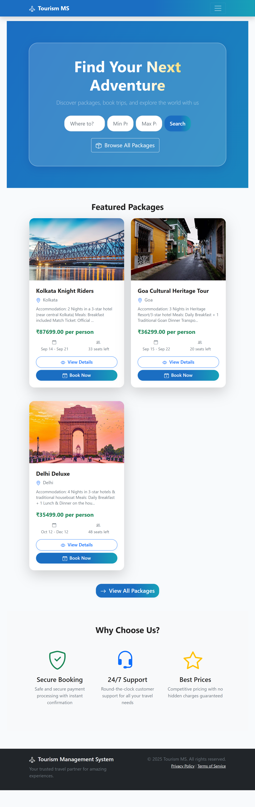

### Package Listings
Browse available tourism packages with advanced search and filtering
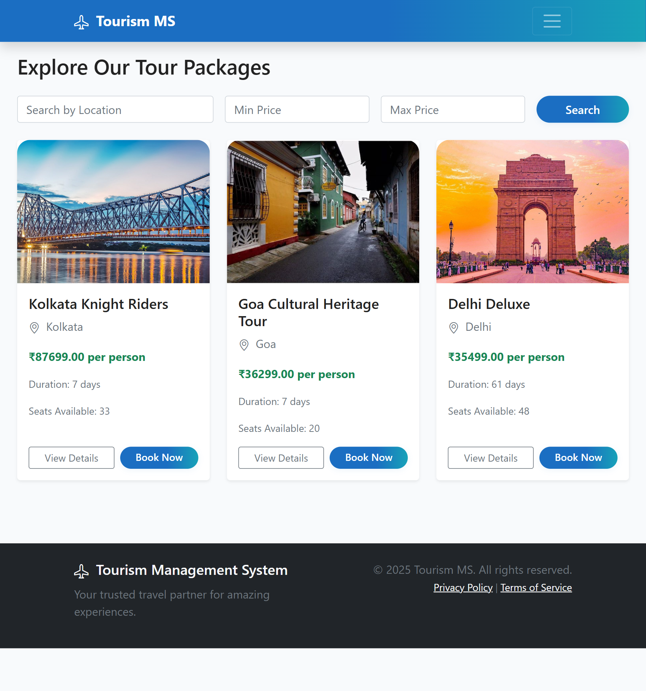

### Package Details
Detailed view of packages with booking options and availability
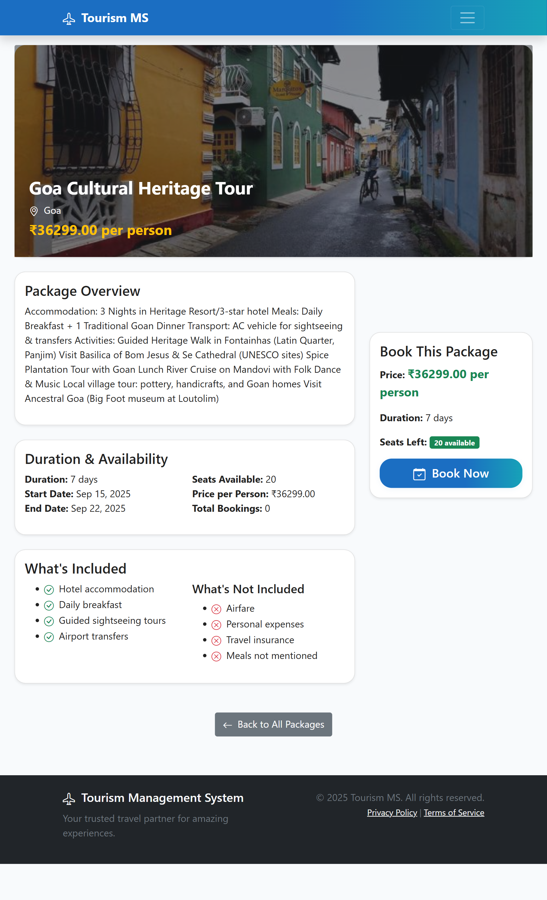

### Booking System
Intuitive booking form with real-time pricing and validation
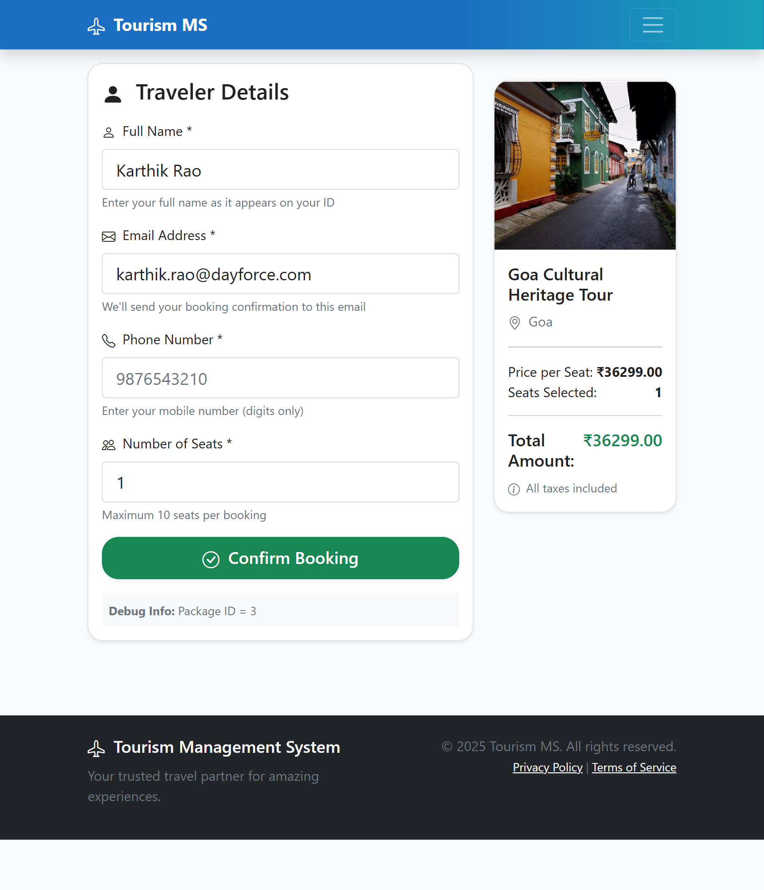

### Payment Checkout
Secure payment page with Stripe integration and currency support
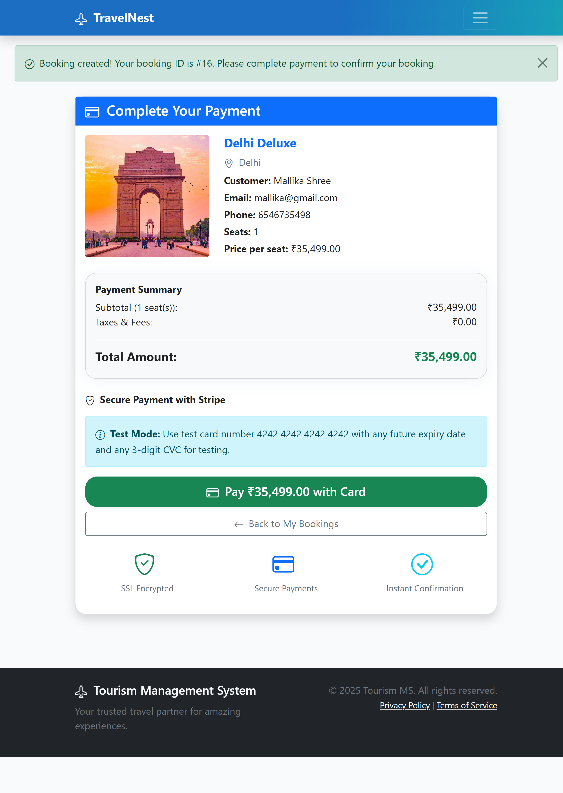

### Stripe Payment Processing
Stripe's hosted checkout page for secure card processing
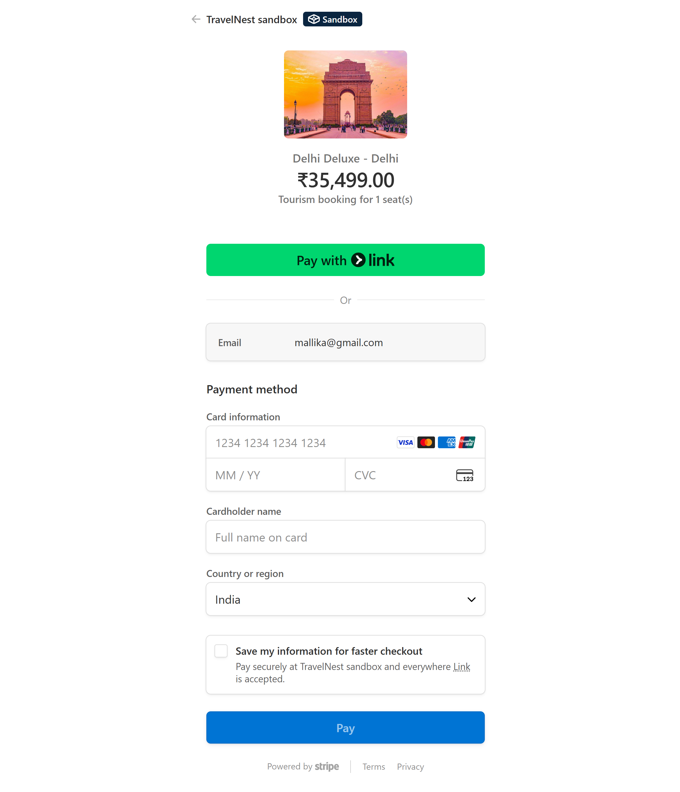

### Booking Confirmation
Confirmation page with booking details and receipt access
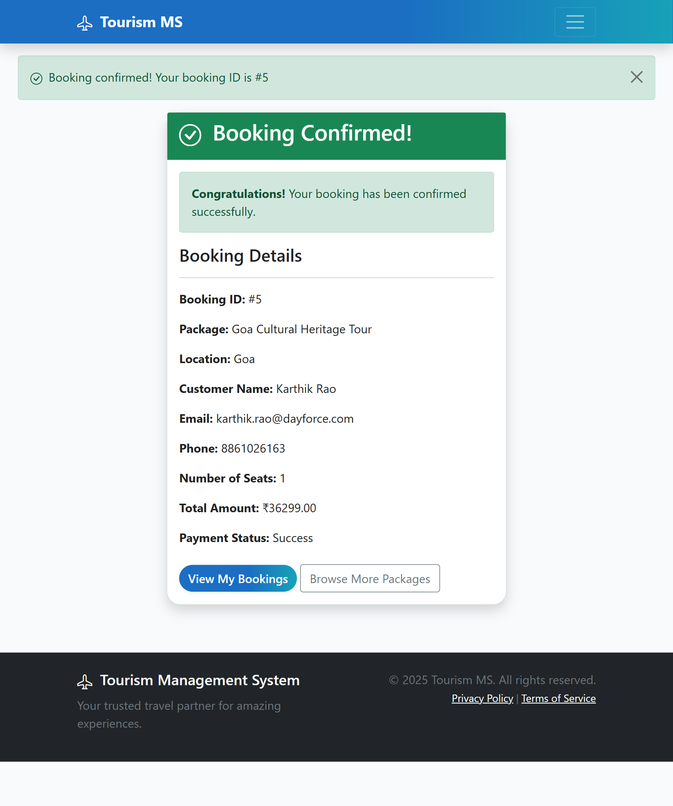

### Payment Receipt
Professional payment receipt with Stripe invoice download
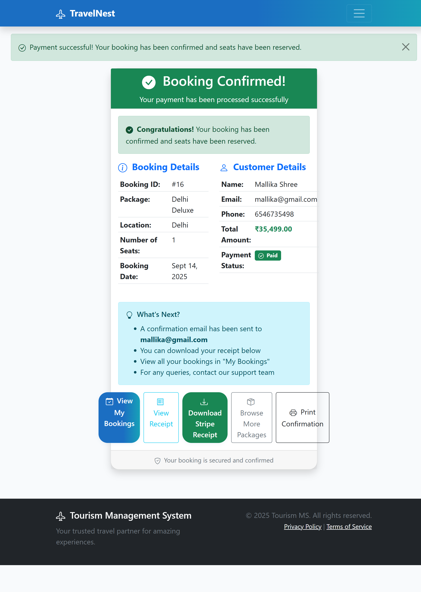

### My Bookings with Payment Status
User dashboard showing booking history and payment status


### Admin Package Management
Administrative interface for managing tourism packages
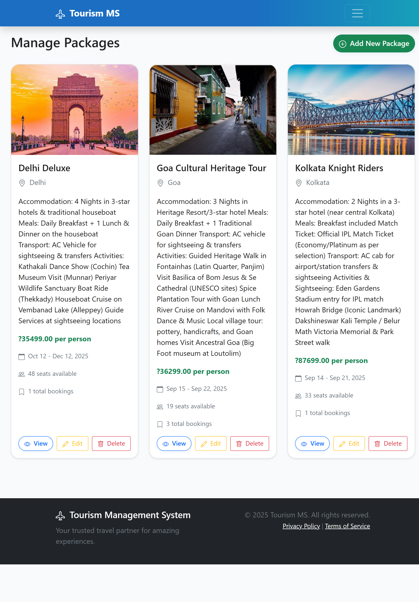

### Package Creation
Admin form for creating new tourism packages
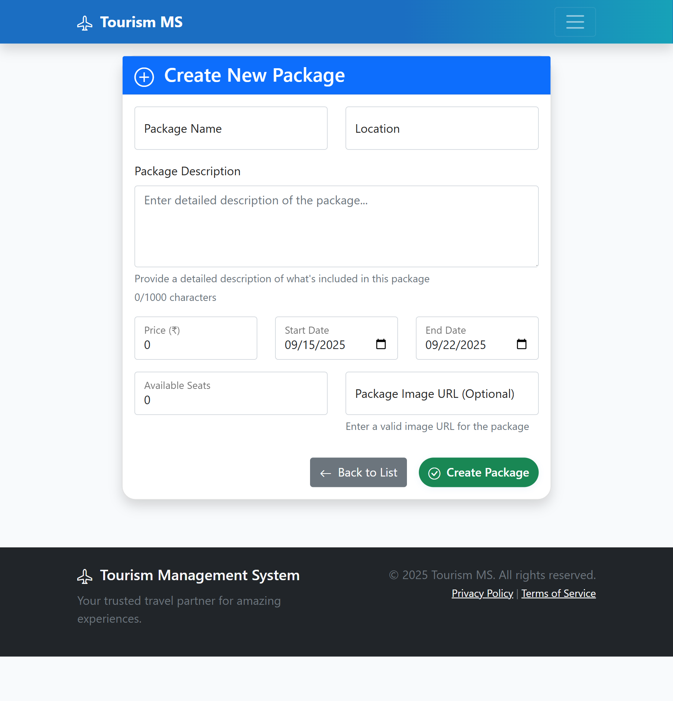

### User Management
Admin interface for managing system users and roles
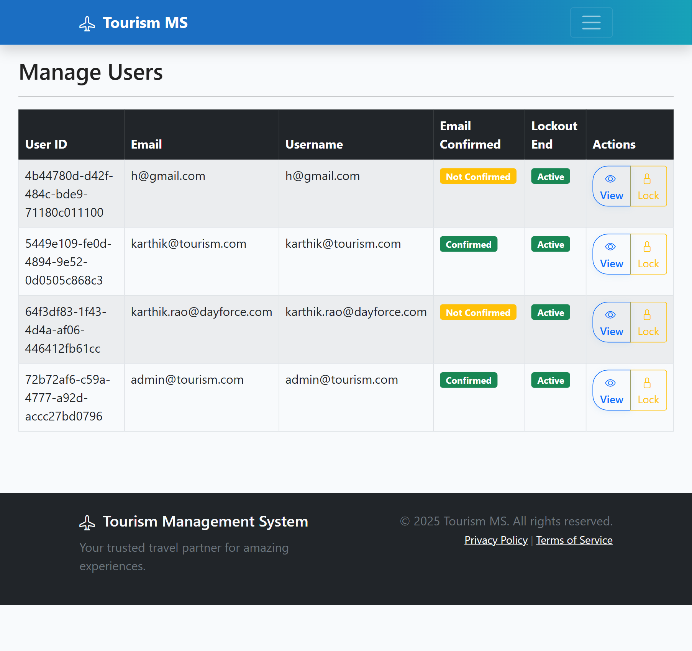

### Admin Payment Management
Administrative view of payment transactions and management
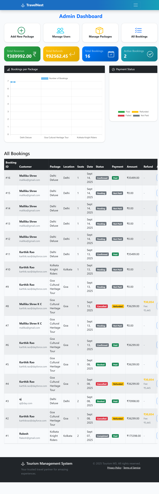

## Technology Stack

### Backend
- **ASP.NET Core 8.0** - Modern web framework
- **Entity Framework Core 8.0** - Object-relational mapping
- **ASP.NET Core Identity** - Authentication and authorization
- **SQL Server** - Primary database
- **Stripe.net SDK** - Payment processing integration

### Frontend
- **Razor Pages** - Server-side rendering
- **Bootstrap 5** - Responsive CSS framework
- **jQuery** - JavaScript functionality
- **Chart.js** - Data visualization
- **Bootstrap Icons** - Icon library
- **Stripe.js** - Client-side payment processing

### Payment Infrastructure
- **Stripe** - Payment processor
- **Stripe Checkout** - Hosted payment pages
- **Stripe Invoicing** - Receipt and invoice generation
- **Webhook Integration** - Real-time payment notifications

### Development Tools
- **Visual Studio 2022** - Primary IDE
- **Entity Framework Migrations** - Database versioning
- **Git** - Version control
- **SQL Server Management Studio** - Database administration

## Getting Started

### Prerequisites

- **.NET 8.0 SDK** or later
- **SQL Server** (LocalDB supported)
- **Visual Studio 2022** or VS Code
- **Git** for version control
- **Stripe Account** (free tier available)

### Installation

1. **Clone the repository**
   ```bash
   git clone https://github.com/karthikurao/TourismManagementSystem.git
   cd TourismManagementSystem
   ```

2. **Restore dependencies**
   ```bash
   dotnet restore
   ```

3. **Configure application settings**
   
   Open `TourismManagementSystem/appsettings.json` and replace the placeholder values:
   
   ```json
   {
     "ConnectionStrings": {
       "TourismDb": "Server=(localdb)\\MSSQLLocalDB;Database=TourismDb;Trusted_Connection=True;MultipleActiveResultSets=true;"
     },
     "Stripe": {
       "PublishableKey": "pk_test_YOUR_ACTUAL_PUBLISHABLE_KEY",
       "SecretKey": "sk_test_YOUR_ACTUAL_SECRET_KEY"
     }
   }
   ```
   
   **To get your Stripe API keys:**
   1. Create a free account at [stripe.com](https://stripe.com)
   2. Go to Dashboard → Developers → API keys
   3. Copy the **Publishable key** (starts with `pk_test_`)
   4. Copy the **Secret key** (starts with `sk_test_`)

4. **Configure Admin Credentials (Optional)**
   
   The default admin credentials are set in `TourismManagementSystem/Data/RoleSeeder.cs`:
   - Email: `admin@tourism.com`
   - Password: `Admin@123456`
   
   **Recommended:** Change these values before deployment for security.

## Database Setup

1. **Apply database migrations**
   ```bash
   dotnet ef database update --project Tourism.DataAccess --startup-project TourismManagementSystem
   ```

2. **Automatic data seeding includes:**
   - Default admin user (Email: admin@tourism.com, Password: Admin@123456)
   - Sample tourism packages
   - User roles (Admin, Customer)
   - Demo payment records
   
   > **Note:** You can change the default admin credentials in `TourismManagementSystem/Data/RoleSeeder.cs` before running migrations.

## Stripe Payment Setup

### Quick Setup Process

1. **Create Stripe Account** at [stripe.com](https://stripe.com)
2. **Get Test API Keys** from Stripe Dashboard → Developers → API keys
3. **Update Configuration** in `appsettings.json`
4. **Test with Cards:**
   - Success: `4242 4242 4242 4242`
   - Decline: `4000 0000 0000 0002`
   - Insufficient Funds: `4000 0000 0000 9995`

**📖 Complete setup guide:** [STRIPE_SETUP.md](STRIPE_SETUP.md)

## Usage

1. **Start the application**
   ```bash
   dotnet run --project TourismManagementSystem
   ```

2. **Access the system**
   - URL: `https://localhost:5211`
   - Admin login: admin@tourism.com / Admin@123456
   - Or register as new customer

3. **Test payment flow**
   - Create booking → Proceed to payment → Use test card → Confirm booking

## Project Structure

```
TourismManagementSystem/
├── TourismManagementSystem/          # Main web application
│   ├── Controllers/                  # Application controllers
│   │   ├── PaymentController.cs      # Stripe payment processing
│   │   ├── BookingController.cs      # Booking management
│   │   ├── AdminController.cs        # Administrative functions
│   │   └── PackageController.cs      # Package operations
│   ├── Views/                        # Razor view templates
│   │   ├── Payment/                  # Payment-related views
│   │   ├── Booking/                  # Booking management views
│   │   ├── Admin/                    # Administrative interfaces
│   │   └── Shared/                   # Shared layouts and components
│   ├── ViewModels/                   # Data transfer objects
│   ├── Helpers/                      # Utility classes (Currency formatting)
│   ├── Areas/Identity/               # ASP.NET Core Identity UI
│   ├── wwwroot/                      # Static assets
│   └── Program.cs                    # Application configuration
├── Tourism.DataAccess/               # Data access layer
│   ├── Models/                       # Entity framework models
│   ├── Migrations/                   # Database migrations
│   └── TourismDbContext.cs          # Database context
├── Screenshots/                      # Application screenshots
├── STRIPE_SETUP.md                  # Payment setup documentation
└── README.md                        # Project documentation
```

## Configuration

### 🔧 Required Setup Before Running

Before the application can function properly, you must configure the following:

#### 1. Stripe API Keys (Required for Payments)

**File:** `TourismManagementSystem/appsettings.json`

| Key | Location | Description |
|-----|----------|-------------|
| `Stripe:PublishableKey` | appsettings.json | Your Stripe publishable key (starts with `pk_test_` or `pk_live_`) |
| `Stripe:SecretKey` | appsettings.json | Your Stripe secret key (starts with `sk_test_` or `sk_live_`) |

**Steps to get keys:**
1. Sign up at [stripe.com](https://stripe.com)
2. Navigate to Dashboard → Developers → API keys
3. Copy and paste keys into appsettings.json

#### 2. Admin Credentials (Optional but Recommended)

**File:** `TourismManagementSystem/Data/RoleSeeder.cs`

The default admin account is created with:
- Email: `admin@tourism.com`
- Password: `Admin@123456`

**To change:** Edit lines 30-31 in RoleSeeder.cs before running the application for the first time.

#### 3. Database Connection String (If not using LocalDB)

**File:** `TourismManagementSystem/appsettings.json`

The default connection string uses SQL Server LocalDB. Modify if using a different SQL Server instance.

### Environment Variables
- `ASPNETCORE_ENVIRONMENT`: Development/Production
- `ConnectionStrings__TourismDb`: Database connection string
- `Stripe__PublishableKey`: Stripe public API key
- `Stripe__SecretKey`: Stripe secret API key

### Key Configuration Files
- `appsettings.json`: Application configuration
- `Program.cs`: Startup configuration with Stripe and localization setup

## Security Features

- **Authentication & Authorization**: ASP.NET Core Identity with role-based access
- **Input Validation**: Comprehensive server and client-side validation
- **CSRF Protection**: Anti-forgery tokens on all forms
- **SQL Injection Prevention**: Entity Framework parameterized queries
- **XSS Protection**: Automatic output encoding
- **PCI Compliance**: Payment processing handled entirely by Stripe
- **Data Isolation**: Users can only access their own bookings
- **Secure Communication**: HTTPS enforcement for all payment operations

## API Endpoints

### Core Functionality
```
GET/POST /Package/*              - Package management operations
GET/POST /Booking/*              - Booking management operations  
GET/POST /Admin/*                - Administrative functions
```

### Payment Processing
```
GET    /Payment/Checkout/{id}           - Payment checkout page
POST   /Payment/CreateCheckoutSession   - Initialize Stripe session
GET    /Payment/Success                 - Payment success handling
GET    /Payment/Receipt/{id}            - Payment receipt display
GET    /Payment/DownloadStripeReceipt/{id} - Stripe receipt download
```

## Key Features

- **Complete Tourism Package Management** with real-time availability
- **Secure Payment Processing** with Stripe integration
- **Multi-format Receipt System** (internal + Stripe invoices)
- **Automated Refund Processing** with 15% cancellation fee
- **Responsive Multi-device Support** with mobile-first design
- **Comprehensive Admin Dashboard** with analytics and reporting
- **Role-based Security Model** for customers and administrators
- **Real-time Booking Management** with instant confirmations

## Testing

### Payment Testing with Stripe Test Cards
- **Successful Payment**: `4242 4242 4242 4242`
- **Card Declined**: `4000 0000 0000 0002`
- **Insufficient Funds**: `4000 0000 0000 9995`
- **Expiry**: Any future date (e.g., 12/25)
- **CVC**: Any 3 digits (e.g., 123)

## License

This project is licensed under the MIT License.

## Author

**Karthik U Rao**  
Tourism Management System with Stripe Payment Integration

## Acknowledgments

- ASP.NET Core team for the robust framework
- Stripe for providing secure payment infrastructure
- Bootstrap team for the responsive design framework
- Chart.js for data visualization capabilities
